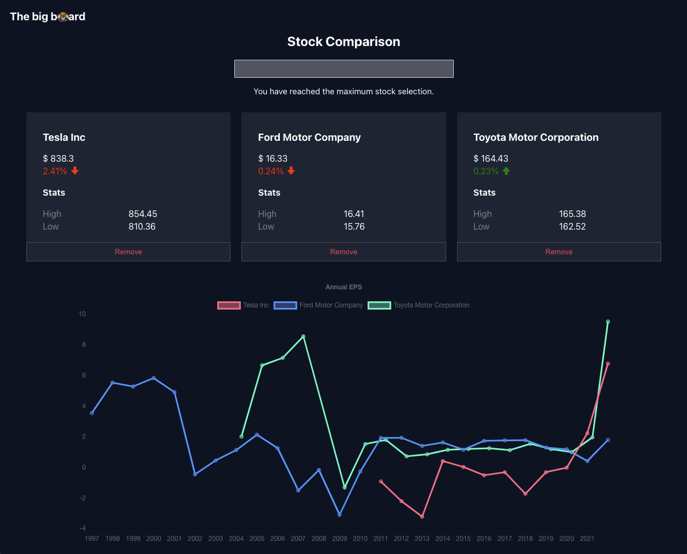

# The big board

A simple stock comparison application built on React and TypeScript with chart.js for visualization.

This app allows searching by company name or symbol and to compare stocks based on historical EPS data.

## Improvements to be made

1. Add e2e tests
2. Add more comments and documentation
3. Add utility functions around chart data and REST API URLs
4. Improve error handling.
5. Improve handling around API limits issues

## Getting started

This repo uses eslint for linting and React testing library for tests.  Husky is used to lint and test before each commit.

### Environment

For the REST API calls to work, you'll need to create a `.env` file in the root of this project with the `REACT_APP_API_KEY` key.

`REACT_APP_API_KEY=your_key`

You can create an API key [here](https://www.alphavantage.co/support/#api-key).

### Node version

* This app uses node v16.  You can install `nvm` and run `nvm use v16`.
### `npm start`

Runs the app in the development mode.\
Open [http://localhost:3000](http://localhost:3000) to view it in the browser.

The page will reload if you make edits.\
You will also see any lint errors in the console.

### `npm test`

Launches the test runner in the interactive watch mode.

### `npm run build`

Builds the app for production to the `build` folder.\
It correctly bundles React in production mode and optimizes the build for the best performance.
